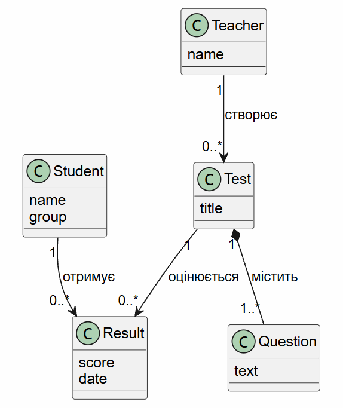

# OOP22_Init
# Назва проекту
StudyTest
## Про що проект
ПЗ для тестування знань студентів: викладач створює тести,
студенти проходять їх і отримують оцінку.

## Навіщо цей проект
Навчитися програмувати мовою Java.

## Основні сутності
- Студент
- Викладач
- Тест
- Питання
- Результат

## Приклади / посилання
- Посилання на схожі існуючі проєкти або демо
- https://github.com/raunak-r/quiz-app
- https://github.com/ajaymahadeven/Quizzy-App

## Концептуальна діаграма класів
