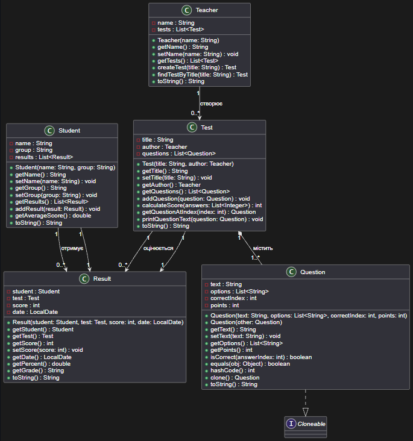

# OOP22_Init
# Назва проекту
StudyTest
## Про що проект
ПЗ для тестування знань студентів: викладач створює тести,
студенти проходять їх і отримують оцінку.

## Навіщо цей проект
Навчитися програмувати мовою Java.

## Основні сутності
- Студент
- Викладач
- Тест
- Питання
- Результат

## Тестування

Проєкт покритий модульними тестами (JUnit 4). Тести перевіряють:
- коректність визначення правильної відповіді на питання тесту;
- роботу методу equals() для порівняння об'єктів Question;
- глибоке клонування об'єктів (clone()) та незалежність копій;
- обробку виходу за межі масиву (ArrayIndexOutOfBoundsException);
- обробку звернення до null-об'єкта (NullPointerException).

Тестові класи знаходяться в директорії `test/ua/edu/op/nkpk/model`.

## Технології

- Java 25
- JUnit 4.13.2
- Hamcrest 1.3
- 
## Приклади / посилання
- Посилання на схожі існуючі проєкти або демо
- https://github.com/raunak-r/quiz-app
- https://github.com/ajaymahadeven/Quizzy-App

## Концептуальна діаграма класів
